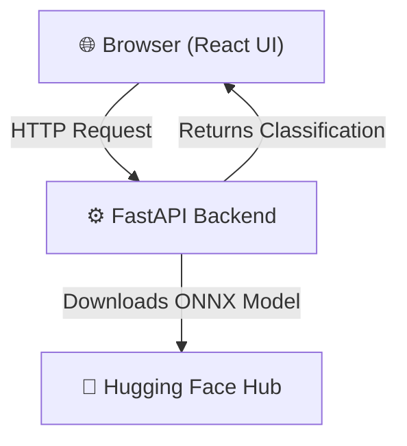

# Fake News Detection

A full-stack web application that uses a Bidirectional LSTM neural network and ONNX Runtime to classify news articles as real or fake in real-time.

## Features

- **LSTM Neural Network** — Deep learning model trained to analyze text semantics for high-accuracy fake news classification.
- **ONNX Runtime Engine** — High-performance backend inference powered by FastAPI, downloading models on-the-fly from the Hugging Face Hub (`VPM100/fake-news-detection-model`).
- **Interactive Interface** — A fast, responsive React frontend built with Vite for easy article verification.
- **Batch Processing** — Supports predicting multiple articles at once via an optimized API endpoint.

## Architecture



## Project Structure

```
fake-news-detection/
├── backend/              # FastAPI backend and ONNX inference logic
│   ├── artifacts/        # Directory for downloaded model files
│   └── main.py           # Main API routes and server config
├── frontend/             # React + Vite frontend application
│   ├── public/           # Static assets
│   └── src/              # React components and pages
├── notebooks/            # ML preprocessing and training scripts
│   └── fake_news_detection_LSTM.ipynb
├── .gitignore
├── LICENSE
└── README.md
```

## Getting Started

### Prerequisites

- [Node.js](https://nodejs.org/) ≥ 18
- [Python](https://www.python.org/) ≥ 3.9

### Installation

Clone the repository and set up both the backend and frontend.

```bash
git clone https://github.com/VIVPM/fake-news-detection.git
cd fake-news-detection
```

**Backend Setup:**
```bash
cd backend
python -m venv .venv
# On Windows use: .venv\Scripts\activate
# On Mac/Linux use: source .venv/bin/activate
pip install -r requirements.txt
```

**Frontend Setup:**
```bash
cd ../frontend
npm install
```

### Environment Setup

Create a `.env` file in the `backend/` directory to configure the Hugging Face Hub token for downloading the model.

```bash
cd backend
cp .env.example .env # Create the .env manually if no example exists
```

Required variables:

| Variable | Description |
| -------- | ----------- |
| `HF_TOKEN` | Hugging Face Access Token to download model artifacts. |
| `HF_REPO_ID` | Model repository ID (Defaults to `VPM100/fake-news-detection-model`). |

### Running Locally

You'll need two terminal tabs open—one for the backend and one for the frontend.

**1. Start the FastAPI Backend:**
```bash
cd backend
# Make sure your virtual environment is active
uvicorn main:app --reload
```
The API is now running on `http://localhost:8000`.

**2. Start the React Frontend:**
```bash
cd frontend
npm run dev
```
Open `http://localhost:5173` (or whichever port Vite outputs) in your browser.

## Model Performance

The underlying Bidirectional LSTM Network was trained on extensive real and fake news datasets, achieving the following metrics over 10 epochs (as seen in `fake_news_detection_LSTM.ipynb`):

- **Training Accuracy**: ~99.02%
- **Validation Accuracy**: ~97.91%
- **Validation Loss**: ~0.0530

These high accuracy metrics demonstrate robust and reliable text classification in production.

## API Endpoints

The FastAPI backend natively exposes the following endpoints (available at `http://localhost:8000/docs` via Swagger UI):

- `GET /health` — Check if the server is running and the ONNX model is loaded into memory.
- `POST /predict` — Analyzes a single news article text and returns a classification (`Real` or `Fake`), confidence level, and raw score.
- `POST /predict/batch` — Receives a list of articles and performs batch-processing through the neural network.

## Machine Learning Notebooks

The `notebooks/` directory contains the data preprocessing, exploratory data analysis, and model training scripts (e.g., `fake_news_detection_LSTM.ipynb` and `Fake_news_preprocessing.ipynb`) used to train the underlying LSTM model before it was exported to the ONNX runtime. Note: large raw CSV datasets are excluded from the repository.

## License

This project is licensed under the MIT License. See [LICENSE](./LICENSE) for details.